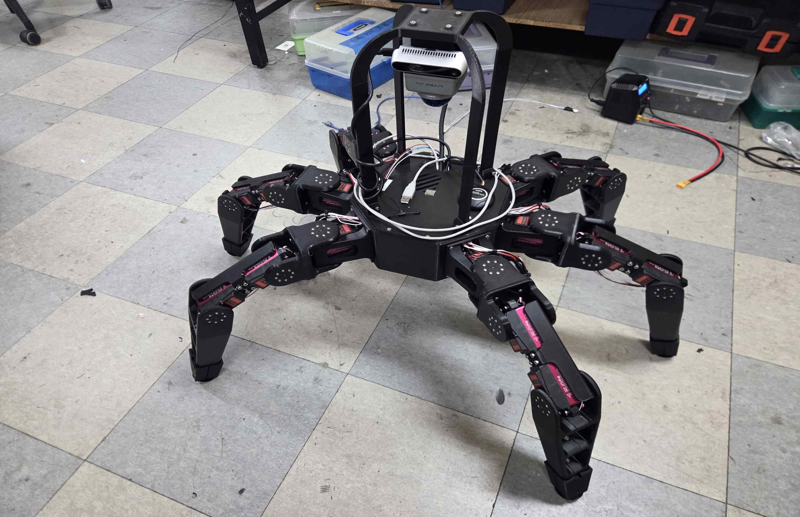
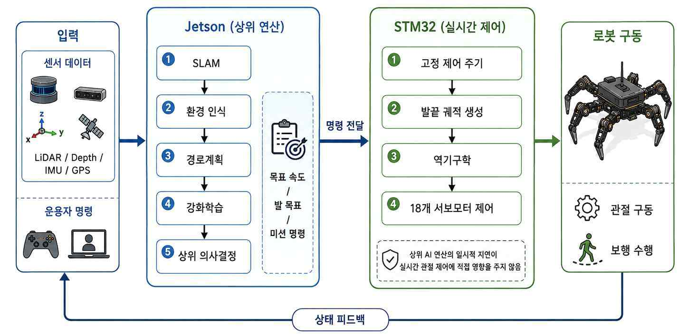
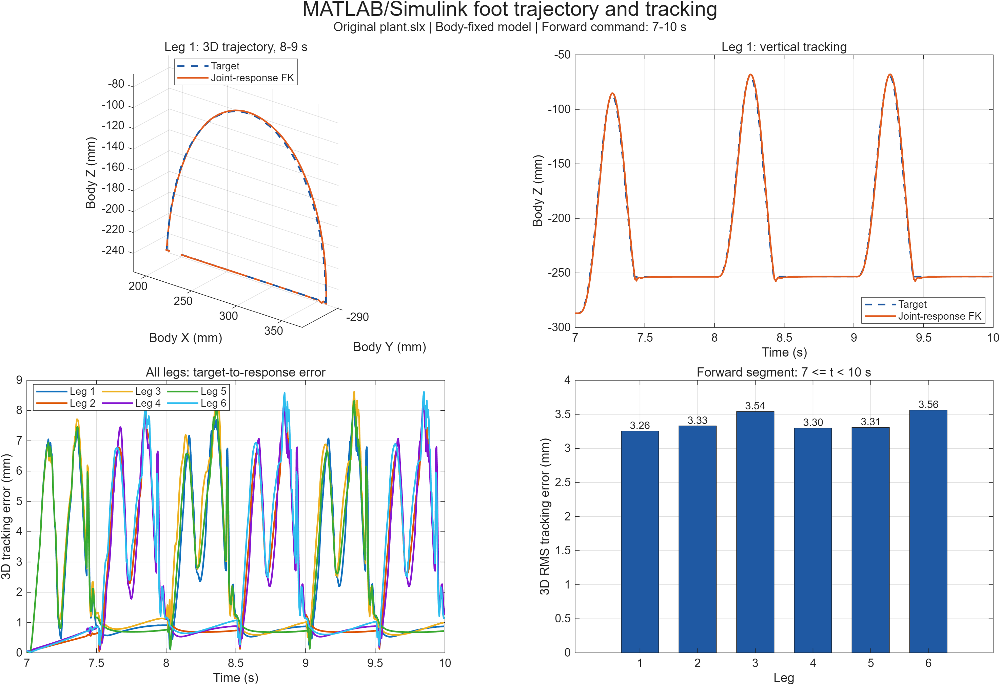

<div align="center">

# 모듈형 재난대응 6족 로봇

### Physical AI 기반 험지 이동·환경 인식·임무 확장 플랫폼

[](SW/Jetson/README.md)
[](SW/STM32/STM32F446RE%20설정%20정리본.md)

[](SW/Controller/Controller_Architecture.md)


**험지개척단 · 인하대학교 · 2026 종합설계경진대회**



</div>

## 프로젝트 소개

본 프로젝트는 붕괴 구조물, 잔해, 경사면, 단차와 계단처럼 사람이 직접 접근하기 어려운 재난 현장을 선행 탐색하기 위한 6족 보행 로봇이다. 하나의 공통 보행 플랫폼 위에 센서와 작업 장비를 교체할 수 있는 모듈형 구조를 적용하여, 환경 매핑·자율 탐색·현장 조작·구호물품 전달 등 임무별 구성을 목표로 한다.

6개의 독립적인 3자유도 다리와 총 18개의 관절을 사용하며, **수식 기반 Classical Controller가 안정적인 기본 보행과 안전 제한을 담당하고 강화학습이 제한된 발끝 보정량만 추가하는 계층형 제어 구조**를 채택하였다. Jetson은 SLAM·환경 인식·경로계획·강화학습 등 상위 연산을, STM32는 200 Hz 주기의 발끝 궤적·역기구학·서보 제어를 담당하도록 분리하였다.

> [!NOTE]
> 이 저장소는 구현 코드, 설계 자료, 시뮬레이션 결과와 개발 문서를 함께 관리한다. 기능별 완성도와 검증 수준이 다르므로 아래의 **현재 구현 상태**와 각 문서의 검증 범위를 확인해야 한다.

## 핵심 특징

| 영역 | 주요 내용 |
|---|---|
| **험지 보행** | Tripod Gait, 3차 Bézier 발끝 궤적, 3자유도 역기구학, 18개 서보모터 제어 |
| **접촉 적응** | 6개 FSR 접촉 상태 기반 Early Landing·Late Landing 보정과 작업영역 제한 |
| **계층형 Physical AI** | Classical Controller의 발끝 목표에 제한된 Cartesian Residual을 더하는 강화학습 구조 |
| **환경 인식** | Livox MID-360, RealSense D435, IMU를 이용한 3차원 인식·SLAM·경로계획 구조 |
| **분산 제어** | Jetson 상위 판단과 STM32 실시간 보행 제어 분리, 32바이트 SPI 상태 프레임 |
| **모듈형 임무 확장** | 센서 위치 변경, 열화상·가스 센서, 매니퓰레이터, 구급·적재 모듈 확장 고려 |
| **원격 운용** | 위치·자세·통신·이동 경로 모니터링과 목적지·모드·비상 정지 명령 구조 |

## 시스템 구성

<div align="center">
  
</div>

```text
LiDAR / Depth Camera / IMU / 운용자 명령
                    │
                    ▼
Jetson Orin Nano Super
SLAM → 환경 인식 → 경로계획 → 강화학습·상위 의사결정
                    │  목표 속도·발 목표·임무 명령
                    ▼
STM32 NUCLEO-F446RE
고정 제어 주기 → 발끝 궤적 → 3DOF IK → 18개 서보 제어
                    │
                    ▼
              6족 로봇 구동
                    │  관절각·접촉·IMU 상태
                    └──────────────────────► Jetson / 관제 시스템
```

### STM32 ↔ Jetson 통신

STM32 측에는 SPI2 Slave DMA 기반 32바이트 센서 프레임 v2가 구현되어 있다. 프레임은 18개 관절각, 6개 발 접촉 상태, IMU Roll·Pitch·Yaw, Sequence와 CRC-16/CCITT-FALSE를 포함한다. Jetson은 `DRDY` 신호를 확인한 뒤 SPI Master로 한 프레임을 교환하는 구조다.

- 기준 주기: `5 ms` (`200 Hz`)
- SPI: `Mode 0`, `8-bit`, `MSB First`
- 프레임: `32 bytes`, Little Endian
- 검증: Magic, Version/Type, Sequence, CRC-16/CCITT-FALSE
- 상세 규격: [STM32–Jetson SPI 32바이트 패킷 프로토콜](SW/STM32/STM32-Jetson%20SPI%2032바이트%20패킷%20프로토콜.md)

## 보행 및 지형 적응 제어

### 1. Classical Controller

세 다리가 지면을 지지하는 동안 나머지 세 다리를 이동시키는 Tripod Gait를 사용한다. 스윙 발의 경로는 3차 Bézier 곡선으로 생성하고, 발끝 목표 좌표를 각 다리의 3자유도 역기구학으로 관절 목표각으로 변환한다. 작업영역과 IK 유효성을 검사하여 비정상적인 관절 명령이 출력되지 않도록 제한한다.

### 2. FSR 접촉 보정

- **Early Landing:** 예상보다 먼저 접촉하면 스윙을 종료하고 지지 상태로 전환
- **Late Landing:** 예정된 착지 시점에도 미접촉이면 발끝을 추가 하강하여 지면 탐색
- **기준 높이 보정:** 접촉 보정이 반복되어 몸체 높이가 누적 변화하지 않도록 기준값 보정

### 3. Residual Reinforcement Learning

강화학습이 18개 관절을 직접 제어하지 않고, Classical Controller가 생성한 발끝 목표에 제한된 Cartesian 보정량을 추가한다.

```text
p_command = p_classical + Δp_RL
```

Residual 출력이 비정상이거나 센서·통신 상태가 안전 기준을 벗어나면 보정을 차단하고 기본 보행 또는 정지 상태로 복귀하도록 설계하였다.

## 모듈형 재난 대응 시나리오

하나의 6족 플랫폼을 임무에 맞춰 재구성하는 것이 프로젝트의 핵심 방향이다.

| 구성 | 역할 | 현재 범위 |
|---|---|---|
| **LiDAR·IMU 모듈** | 3D 지도 생성, 위치·자세 추정, 자율 탐색 | 하드웨어·시스템 구조 개발 |
| **센서 위치 변경** | 고정형 LiDAR의 사각지대 보완, 목적별 공간 정보 수집 | 장착 구조 확장 방향 |
| **매니퓰레이터** | 문 개방, 가벼운 장애물 이동, 현장 작업 | 확장 모듈·실물 통합 검증 필요 |
| **구급·적재 모듈** | 구급상자, 센서와 필수 물품 전달 | 확장 제안 |
| **열화상·가스 센서** | 인명·열원 탐색, 유해 환경 측정 | 확장 제안 |

```text
현장 투입 → 환경 인식·지도 생성 → 통과 가능성 판단
         → 자율주행·험지 이동 → 현장 조작 또는 물자 전달
         → 상태 보고·필요 시 원격 개입
```

## 현재 구현 및 검증 상태

| 항목 | 상태 | 검증 범위 |
|---|---|---|
| 6족 기구·18자유도 구동부 | 제작 | Fusion 360, 분리형 다리·몸체·센서 장착부 |
| STM32 기본 보행 제어 | 구현 | Tripod Gait, Bézier 궤적, IK, Safety, FSR 접촉 처리 |
| STM32 실시간 로깅 | 구현 | 접촉 상태, 보행 Phase, 발끝 목표, IK 결과, 관절 목표각 |
| STM32–Jetson 상태 통신 | STM32 측 구현 | SPI v2 프레임, CRC, Sequence, DRDY 기반 DMA |
| MATLAB/Simulink 제어 시험 | 실행·기록 | 몸체 고정 모델의 0–81 s 단일 시험, 실제 자유 보행 성능 아님 |
| Isaac Sim·MuJoCo | 시뮬레이션 구성 | 보행·Residual-RL 학습 구조, 실물 성능과 별도 검증 필요 |
| Jetson SLAM·자율주행 | 설계·통합 대상 | 현재 `SW/Jetson`에는 실행 코드가 아닌 범위·인터페이스 문서 수록 |
| 원격 관제·LoRa | 시스템 설계 | 실시간 현장 운용 성능은 별도 검증 필요 |

### 공개된 Simulink 시험 결과

2026-08-31에 기존 `plant.slx`를 MATLAB R2026a Update 3에서 실행한 결과다. 몸체가 월드에 고정된 관절·기구학 제어 시험이므로 실제 험지 주행 성능으로 해석하면 안 된다.

| 평가 항목 | 결과 |
|---|---:|
| 6개 다리 통합 발끝 RMS 거리 오차 | **3.385 mm** |
| 발끝 최대 거리 오차 | **8.631 mm** |
| 18개 관절 통합 RMS 오차 | **0.4004°** |
| 6개 다리 IK 유효 표본 비율 | **100%** |

<div align="center">
  
</div>

자세한 조건, 원시 데이터와 재현 절차는 [MATLAB/Simulink 실행 결과](SW/Controller/Simulink/evaluation/RESULTS.md)를 참고한다. 평지 10 m 보행 성공률, 실제 평균 보행 속도, 최대 단차·경사, 계단 통과율, 실제 경로 추종 오차와 Residual-RL 전후 비교는 현재 공개 자료만으로 확정하지 않았으며 임의 수치를 제시하지 않는다.

## 저장소 구성

```text
Hexapod-Robot/
├─ HW/
│  ├─ PCB/                  # PCB Gerber·Drill 자료
│  ├─ stl_file/             # 3D 프린팅용 STL
│  ├─ gcode_file/           # G-code·3MF
│  └─ urdf/                 # 현재 URDF·시뮬레이션 설정
├─ SW/
│  ├─ Controller/           # 보행 제어 수식·좌표계·Simulink
│  ├─ STM32/                # STM32CubeIDE 펌웨어·통신 문서
│  └─ Jetson/               # 상위 제어 범위·인터페이스 문서
└─ docs/
   ├─ assets/               # README 이미지
   └─ 2026-inha-capstone-final-report-public.pdf
```

## 주요 문서

- [2026 인하 종합설계경진대회 최종보고서 - 공개용](docs/2026-inha-capstone-final-report-public.pdf)
- [하드웨어 구성 및 제작 자료](HW/README.md)
- [하드웨어 부품 목록](HW/parts.md)
- [제어기 Architecture](SW/Controller/Controller_Architecture.md)
- [제어기 상세 설계](SW/Controller/Controller_detail.md)
- [좌표계와 관절 정의](SW/Controller/좌표축/README.md)
- [STM32F446RE 설정](SW/STM32/STM32F446RE%20설정%20정리본.md)
- [STM32 코드 구조](SW/STM32/STM32%20코드%20구조%20정리본.md)
- [STM32–Jetson SPI 프로토콜](SW/STM32/STM32-Jetson%20SPI%2032바이트%20패킷%20프로토콜.md)
- [매니퓰레이터 UART 프로토콜](SW/STM32/Manipulator_UART_Protocol.md)
- [Jetson 소프트웨어 범위](SW/Jetson/README.md)
- [Simulink 평가 결과 및 재현 절차](SW/Controller/Simulink/evaluation/RESULTS.md)

## 주의 사항

- 고토크 서보모터와 LiPo 배터리를 사용하는 시스템이므로 전원·배선·비상 정지 절차를 먼저 확인해야 한다.
- 소스 코드, 빌드 결과물, 실제 보드에 플래시된 펌웨어와 실물 시험 결과는 서로 다른 검증 단계다.
- 보고서와 시뮬레이션의 미평가 항목은 실패나 0%를 뜻하지 않으며, 반복 실물 시험 후 수치화해야 한다.

---

<div align="center">

**One hexapod platform, multiple disaster-response missions.**

</div>
