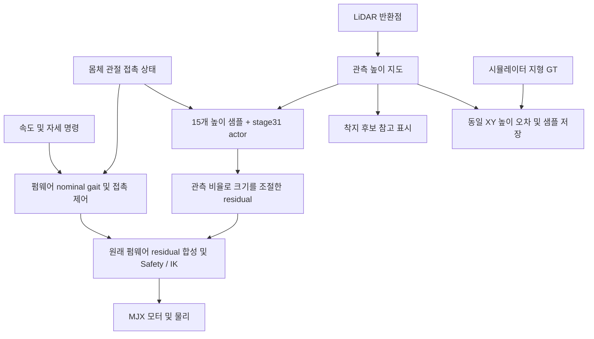

# LiDAR 입력과 GT 정답을 사용하는 residual 보행

최종 결정: 2026-09-06. 현재 실행 구조는 **펌웨어 기본 제어기 연속 보행 + 학습 residual**이다.
이 문서가 과거 geometric foothold 경로를 직접 제어기에 주입하던 계획보다 우선한다.
[실행 안내](HEXAPOD_FOOTHOLD_PREVIEW_USAGE.md)와 [업데이트 기록](HEXAPOD_UPDATE_2026-09-06.md)을 함께 본다.

## 다음 학습 목표

후속 목표는 **MJX에서 착지 위치·스윙 여유 높이·몸체 자세·보폭·주기 residual을 학습한 뒤 Isaac Lab으로 이전**하는 것이다.
[새 파라미터 학습 설계](HEXAPOD_MJX_ADAPTIVE_GAIT_LEARNING_PLAN.md)의 23-D 제안과 teacher/student 순서를 따른다.
아래는 현재 구현된 stage31 viewer이며, 새 학습 계약의 구현 완료를 뜻하지 않는다.

## 현재 구현

- 원래 v3 펌웨어 step이 보행 위상·접촉·posture·foot memory·IK·관절 속도 제한을 소유한다.
- 외부 월드 경로로 발 목표를 덮어쓰거나 stance anchor를 주입하지 않는다.
- 미관측 첫걸음은 residual=0으로 진행한다. 관측이 생겨도 gait를 교체하지 않고 residual 크기만 부드럽게 조절한다.
- 현재 임시 gain은 `scale × 15개 정책 높이 샘플의 관측 비율`이다. 다리별 착지 가능성이나 학습된 confidence는 아니다.
- actor의 지형 15개 입력은 LiDAR 지도만 사용한다. GT pitch feedforward/swing boost는 끈다.
- 몸체/odom은 현재 MuJoCo 상태로 공급한다. 실제 LIO/IMU 상태 추정은 미구현이다.
- geometric 후보는 디버깅·후속 점수 설계 자료다. 기본 동역학 모드에서 그 위치로 발을 보내지는 않는다.

이전 경로 주입 구현에서는 관측 경로와 nominal/posture/접촉 전환을 혼합하고 corrected foot memory를
다시 사용했다. 사용자가 관측 착지 시 IK 문제를 보고한 뒤 이를 제거했다. 원인 후보는 코드에서
확인했으나 이번 수정의 동역학 재현·등반 성공 여부는 사용자가 검증한다.

## 학습에서 LiDAR와 GT의 역할

사용자가 제안한 **LiDAR로 인식하고 GT와 비교해 학습하는 방향**을 다음처럼 구분한다.

| 경로 | 사용할 정보 | 목적 |
|---|---|---|
| 배포 actor | LiDAR 관측/추정 높이, valid/confidence/age, IMU·관절·접촉 추정, command, controller state | residual 출력 |
| perception encoder/decoder | 센서 입력 → 높이/신뢰도 예측, GT는 loss의 target | 인식 오차·공백에 강한 표현 학습 |
| privileged critic | actor 상태 + GT 지형·물리 상태 | 학습 중 value 추정 |
| GT teacher | GT 정보와 기본 제어기 | 배포 불가 기준 정책·student distillation |
| reward/evaluation | 진행·넘어짐·미끄러짐·접촉·에너지·GT 지형 | 실제 보행 성능 학습/평가 |

**지도 오차만 줄이는 학습과 보행 학습은 별개다.** 높이 GT와의 Huber/L1 loss는 인식 모듈을
학습시킨다. residual actor에는 전진·안정성·접촉·제어 effort 보상 또는 teacher imitation이 필요하다.
GT를 teacher/critic/복원 loss에 쓰고, student가 noisy elevation map을 쓰는 구조는
[Learning robust perceptive locomotion 연구](https://leggedrobotics.github.io/rl-perceptiveloco/)의
teacher–student 방식과도 연결된다. 해당 결과를 이 hexapod의 성능 보장으로 해석하지 않는다.

## 권장 후속 순서 — 아직 완료하지 않은 학습 작업

1. 같은 odom 좌표와 센서 시각에서 LiDAR 높이·valid·age·GT 높이를 쌍으로 수집한다. GT로 관측 공백을 채우지 않는다.
2. 높이/신뢰도 인식 모듈을 GT label로 학습한다. 관측 셀과 미관측 추론 셀의 loss/평가를 나누고, 미관측 추정은 측정값과 구분한다.
3. stage31은 GT teacher 후보로 사용한다. 기존 146-D actor에 mask·age·history를 덧붙이면 입력 계약이 바뀌므로 가중치 전체를 그대로 restore하지 않는다.
4. 공통 proprioception 표현의 호환성을 확인한 뒤, 센서 student를 teacher action/latent distillation으로 초기화한다. 현재 stage31의 안전 gate 통과가 확인된 것은 아니다.
5. 기본 제어기를 고정하고 sensor actor + privileged critic으로 residual PPO를 fine-tune한다. 시작은 residual=0/평지, 이후 낮은 단차→계단이다.
6. FOV 가림, sparse returns, noise, dropout, latency, extrinsic·odom 오차를 포함한다. 학습/평가 지형의 riser·tread·시작 위치·방향도 분리한다.
7. actor export에는 GT tensor와 decoder target 경로가 포함되지 않는지 확인한다. Jetson은 residual을, STM32는 gait·Safety/IK를 맡는다.

추정기가 관측하지 못한 발밑 높이를 예측할 수는 있지만 불확실성을 함께 출력해야 한다.
관측 공백을 무조건 평지로 간주하거나 GT로 메우는 학습은 실제 첫걸음 문제를 해결하지 못한다.

## 현재 비교 자료의 범위

뷰어는 15개 정책 높이 샘플에 대해 같은 XY의 LiDAR/GT 비교를 계산한다.

- 입력은 4 cm LiDAR map 셀 높이, 기준은 2 cm 코스 raster의 bilinear 높이다.
- valid 셀만 RMSE/bias를 계산한다. 무관측은 `n/a`다.
- 기록에는 XY, 입력 pose, simulation/monotonic 시각, support height, valid/age가 포함된다.
- GT 조회는 action 계산 후 진단 경로에서 수행하며 정책 입력으로 되돌리지 않는다.
- P로 `latest_lidar_gt_pair.npz` 한 쌍을 저장한다. 연속 데이터셋 수집·학습 loss·student trainer는 후속 구현이다.
- 각 샘플은 지도 누적의 관측 시각을 가진다. moving terrain이나 odom drift를 다룰 때 현재 GT와의 단순 비교만으로 센서 오차를 분리할 수는 없다.

## 모델·버전과 센서 계약

현재 viewer는 stage31의 v3/18-D residual·146-D observation과 기록된 normalizer를 사용한다.
루트 MJX/Isaac 개발 코드는 v4/100 mm residual이므로, v3 가중치와 혼합하지 않는다.
같은 차원이어도 행동 의미가 다르면 별도 정책으로 취급한다.

MID-360 기본 measured TF는 밑면 중심 기준 높이 215 mm, 전방 13.529 mm, 위를 향해 전방 45°다.
수평 FOV 360°, 수직 -7°~+52°, 8×8 m/4 cm/60초 rolling map을 사용한다.
CAD URDF fixed chain과 측정 override는 출처를 manifest에 구분한다. 현재 rays는 angular proxy다.

D435IF RGB는 후속으로 traversability/semantic score를 지도에 projection하는 데 사용한다.
센서 timestamp·camera calibration·TF·가림 처리가 필요하며 현재 실행 경로에 RGB 점수를 넣지 않는다.
과거 LiDAR+Depth 동시 fusion과 직접 foothold correction 설계는 후속 연구 참고로 남긴다.

## 사용자 검증과 미구현 범위

사용자가 같은 동역학에서 `--residual-scale 0`, `0.25`, 기본값을 비교한다. 지도 유무에 따른
연속 스윙, IK 수락/도달 제한, 발 접촉과 실제 상승을 확인한다. 이번 작업은 런타임 테스트를 실행하지 않았다.

아직 완료되지 않은 항목은 LIO, 대규모 paired dataset, sensor student 재학습, actor 전용 배포,
Jetson–STM32 통신/HIL, 실제 계단 등반 검증이다. 문서의 후속 구조를 구현 완료로 간주하지 않는다.
