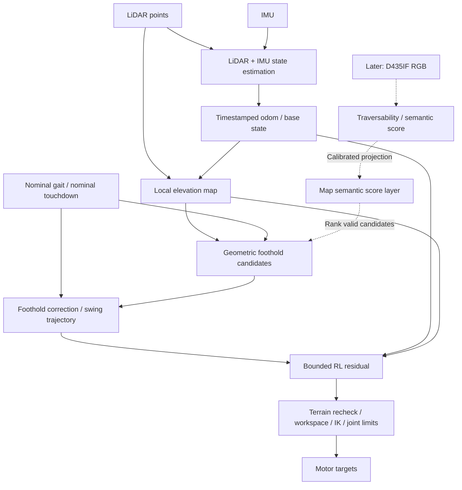

# LiDAR·IMU 기반 foothold correction + RL residual

결정일: 2026-09-06 (Asia/Seoul)

이 문서는 사용자와 정한 새 시스템 구조와 구현 계약이다. 기존
`HEXAPOD_PERCEPTIVE_RESIDUAL_ISAACLAB_PLAN.md`의 LiDAR+Depth 동시 fusion 중심
계획보다 우선한다. 아래 추가 모듈은 구현 목표이며 완료된 기능을 뜻하지 않는다.
첫 시뮬레이터 선택과 무관하게 센서·후보·제어 인터페이스는 동일하게 유지한다.

2026-09-06 1차 구현: MuJoCo의 LiDAR/map/착지 후보/단일 다리 IK 미리보기 코드를 추가했다.
후속 확장으로 방향키 pose 이동, 12×12 m 장애물 코스, odom 관측을 보존하는 rolling map,
여섯 다리 후보 자동 갱신과 표시를 추가했다. 이는 기구학 탐색이며 실제 보행 제어기 연결은 아니다.
이후 방향키 명령으로 두 tripod의 연속 swing, odom stance anchor, swing별 착지 목표 고정과
지도/점군 반투명 표시를 추가했다. STM32 접촉 상태기계 및 동역학 보행은 아직 연결 전이다.
[시작 명령어·환경 구성·사용자 확인 항목](HEXAPOD_FOOTHOLD_PREVIEW_USAGE.md)을 참고한다.
사용자 요청에 따라 실행·테스트는 수행하지 않았다. 실제 동역학 보행·LIO·firmware gait
연결은 이 미리보기의 구현 범위에 포함되지 않는다.

## 1. 데이터 흐름과 역할



- LiDAR+IMU는 자세·위치·속도 및 불확실도를 추정한다. 관절 상태와 접촉 상태는
  별도 proprioception 입력이며 LIO가 모두 제공한다고 가정하지 않는다.
- 맵은 LiDAR 점군에 추정 pose와 시간 동기화를 적용해서 만든다. IMU 회전 보상만으로
  여러 시점의 점군을 누적하면 병진 이동 오차가 남으므로 odometry도 mapper에 입력한다.
- geometric planner는 nominal touchdown 주변에서 지지할 수 있는 착지점을 고른다.
- gait는 타이밍과 접촉 상태를 관리하고 선택된 착지점까지 연속적인 궤적을 만든다.
- RL은 이 궤적에 작은 보정을 추가한다. 최종 명령은 지형 검사와 기존 Safety/IK를 통과한다.
- D435IF RGB는 후속 단계의 후보 평가 정보다. 첫 단계 map의 높이는 LiDAR로 만든다.

## 2. 좌표계·시간 계약

`T_A_B`는 B 좌표의 점을 A 좌표로 변환한다. SI 단위, quaternion `wxyz`를 사용하고,
모든 센서 입력에 측정 timestamp와 frame ID를 둔다.

| Frame | 정의 |
|---|---|
| `odom` | 로컬 연속 상태 추정 좌표계; global map 보정과 분리 |
| `base_link` | 실제 URDF base 좌표계 |
| `controller_body` | +X 전방, +Y 좌측, +Z 상방의 제어 좌표계 |
| `local_map` | 현 위치 중심, 중력 정렬, 현재 heading 기준 좌표계 |
| `lidar`, `imu`, `camera_optical` | 실측 extrinsic으로 연결하는 센서 측정 좌표계 |

CAD 축 변환은 `base_link → controller_body` 경계에서 한 번만 적용한다. 최신 URDF의
센서 외형 중심을 실제 LiDAR/IMU/카메라 측정 원점이라고 가정하지 않는다.

시각 t의 점을 맵 갱신 시각 k로 옮기는 변환은 다음과 같다.

```text
p_local_map(k) = inv(T_odom_local_map(k)) · T_odom_base(t) · T_base_lidar · p_lidar(t)
```

점별 시간이 있으면 scan deskew를 적용하고, 이전 map도 로봇 이동량에 따라 재투영한다.
계획 착지점은 `odom`에 유지하고 제어 tick마다 body 좌표로 변환해, 움직이는 local map에
착지점이 끌려가지 않도록 한다. 상태 추정 reset/jump는 진행 중 계획의 재검증을 유발한다.

## 3. 모듈 인터페이스

| 데이터 | 최소 내용 |
|---|---|
| `BaseState` | timestamp, pose in odom, linear/angular velocity와 각 frame, gravity, covariance, valid/reset flag |
| `LocalElevationMap` | timestamp, T_odom_local_map, resolution/extent, height, validity, height uncertainty, observation age |
| `FootholdCandidates` | leg ID, odom-frame point, nominal deviation, support/slope/roughness/edge scores, validity, map version |
| `FootholdPlan` | leg ID, takeoff/touchdown time, selected odom point, clearance, confidence, valid-until, failure reason |
| `ResidualRequest` | leg order, frame, action-contract version, timestamp, bounded trajectory/clearance corrections |
| `SafetyResult` | accepted target, IK validity, terrain validity, projection/rejection reason, fallback state |

다리 순서는 기존 firmware의 `RF, RM, RB, LF, LM, LB`를 유지한다.
map ROI는 여섯 다리의 nominal touchdown과 검색 반경을 모두 포함해야 한다. 기존
전방 위주 `[-0.40, 1.20] × [-0.60, 0.60] m` grid를 확인 없이 재사용하지 않는다.

기존 rasterizer의 cell max/min 차이는 **수직 분산 범위**이며 surface slope가 아니다.
경사도와 edge 거리는 이웃 셀의 관측 가능성과 높이를 사용해서 별도로 계산한다.
몸체 self-return, 측벽, 돌출물은 지지면 후보와 분리하고 unknown을 평지로 채우지 않는다.

## 4. 착지 후보 선택과 궤적 보정

1. nominal gait의 다음 착지 시각·위치를 구하고 예측 body pose로 검색 영역을 정한다.
2. 다리별 local neighborhood에서 map 셀 또는 patch 후보를 만든다.
3. unknown/stale, 지지 면적 부족, 큰 높이 불확실도, 과도한 경사·단차, edge 근접,
   관절/작업공간 한계, swing 경로 충돌 후보를 제외한다. patch 크기는 발 형상과 여유로 정한다.
4. 동시에 움직이는 다리의 후보 조합도 지지 상태, 다리 간 간섭과 gait 제약으로 검사한다.
5. 유효 후보에 nominal과의 거리, roughness, 경사, edge 여유와 불확실도 cost를 적용한다.
   가중치·허용값은 config와 검증 결과로 관리하며 여기서 실기 확정값을 만들지 않는다.
6. swing 시작에 착지점을 선택하고 trajectory endpoint를 설정한다. 높이 차이는 touchdown
   Z에 반영하고, 경로의 장애물 높이는 별도의 swing clearance에 반영한다.
7. map 갱신마다 목표를 점프시키지 않는다. 재계획은 연속성을 보장하고 touchdown에 가까워지면
   목표를 고정한다. Early/Late Landing과 stance anchor는 기존 접촉 상태기계가 관리한다.

사용자 수정 결정: LiDAR 사각으로 첫걸음 후보가 **미관측**이면 기존 제어기의 nominal
보행으로 시작한다. 이를 `nominal_unknown_terrain`으로 명시하며 지형 안전 검증 완료로
취급하지 않는다. 관측된 충돌·높이 불일치·IK 실패 때문에 후보가 부적합한 경우에는
blind nominal 분기로 우회하지 않는다. 실제 보행에서는 저속으로 시작하고 접촉 적응,
기존 자세·IK·관절 제한을 유지한다. 초기 속도·blind 보행 거리 제한은 실험 설정으로 둔다.

앞에서 관측한 지형을 odom에 유지해 몸 아래로 들어왔을 때도 활용한다. 후보 confidence와
coverage가 연속 갱신에서 확보되면 **다음 swing 경계에서** geometric correction으로
전환한다. 진행 중 swing의 목표를 새 map으로 점프시키지 않는다. nominal도 실행 불가능한
경우에는 접촉 상태에 맞춰 감속·지지 자세로 전환하며 공중 발을 즉시 정지시키지 않는다.

## 5. RL residual과 최종 검사

```text
p_corrected(phase) = continuous_trajectory(takeoff, selected_touchdown, clearance)
p_requested(phase) = p_corrected(phase) + bounded_phase_residual(phase)
p_safe = terrain_and_workspace_validation(p_requested)
q_des = IK + joint position/rate limits + hold/fallback
```

초기 residual은 swing 양 끝에서 0으로 만들어 기하학적으로 선택한 착지점을 유지하고,
중간 궤적과 clearance 보정부터 시작한다. stance 보정은 접촉·미끄럼 제약을 함께 검사한다.
이후 endpoint residual을 추가한다면 최종 touchdown의 patch와 지지 조건을 다시 검증한다.

작업공간 projection은 발을 안전 patch 밖으로 옮길 수 있으므로 projection 후에도 지형을
재검사한다. IK 성공만으로 지형 안전을 판정하지 않는다. residual 거부 시 검증된
geometric trajectory로 복귀하며, 그것도 유효하지 않으면 위의 접촉 상태별 fallback을 쓴다.

Actor에는 추정 base state, 관절·접촉 상태, gait phase, corrected target, 실제 적용된
이전 보정, local terrain과 validity/age를 준다. simulator GT는 critic/reward/진단에만
허용한다. 초기 estimated-state stub을 사용한 실험은 실제 LIO 검증과 구분해 기록한다.

현재 코드의 18-D action은 swing XY, phase-gated swing height와 stance Z 의미를 가진다.
새 endpoint 고정 계약과 같지 않으므로 기존 checkpoint를 그대로 이어 학습하지 않는다.
action/observation version과 기하학 planner config를 checkpoint metadata에 저장한다.

## 6. 후속 RGB 점수 결합

LiDAR map의 3D 지지면 점을 이미지 시각의 camera optical frame으로 변환한 뒤,
캘리브레이션된 intrinsic과 distortion 모델로 RGB pixel에 투영해 semantic score를 읽는다.
RGB pixel만으로 지면의 깊이를 정하지 않는다. 시야 밖, 가려진 면, 오래된 이미지,
낮은 분류 confidence는 semantic unknown으로 남긴다.

```text
valid candidate set = geometric hard constraints
candidate cost = geometric cost + confidence_weighted_semantic_cost
```

RGB가 없으면 geometric cost만 사용한다. semantic 점수는 기하학적으로 invalid인 후보를
살리지 않는다. 이미지와 map은 좌표·시각을 맞추며 score timestamp/confidence도 보존한다.

## 7. 기존 코드와 구현 순서

| 현재 위치 | 확인된 상태 | 필요한 변경 |
|---|---|---|
| `mjx/firmware_mjx_controller.py` | nominal trajectory → residual → workspace/IK | touchdown plan과 trajectory 연결, 최종 지형 재검사 |
| `isaaclab_hexapod/.../perception/elevation_map.py` | 단일 입력 batch의 height/validity/vertical range raster | odom 기반 시간 보상·누적·age/uncertainty, patch 특징 |
| `isaaclab_hexapod/.../tasks/direct/hexapod/hexapod_env.py` | 센서 map feature와 simulation root state 사용 | estimated state 경계, candidate/plan 경로, 누설 방지 |
| `isaaclab_hexapod/.../tasks/direct/hexapod/perceptive_env_cfg.py` | provisional depth sensor 활성화 | 새 LiDAR-only baseline config; RGB는 후속 독립 score layer |

1. **시각화:** 최신 URDF 센서축, LiDAR map, nominal/selected touchdown, rejected candidates,
   swing 경로를 동시에 표시한다. 평지·단차·가림·미관측 구간에서 좌표와 후보를 검증한다.
2. **기하학 baseline:** RL=0에서 correction→trajectory→Safety/IK 경로를 연결한다.
3. **상태 추정·센서 검증:** stub을 LIO/추정 상태로 교체하고 시간 오차·dropout·odom reset,
   자기 몸체 return과 map coverage를 검증한다. 실기 estimator 종류는 이 단계에서 확정한다.
4. **Residual 학습:** geometric-only와 geometric+RL을 동일 조건에서 비교한다.
5. **RGB:** calibration/occlusion을 검증한 뒤 후보 ranking에 추가하고 ablation한다.

완료 gate에는 zero-residual 재현성, no-valid-candidate fallback, swing 연속성,
projection 후 terrain validity, multi-leg reach/support, frame/시간 변환,
map stale/dropout, 동일 센서 입력에서 simulator GT 변경에 actor/제어가 불변인 검사를 포함한다.
실험 지표는 보행 성공률 외에 착지 오차, slip/scuff, rejection 비율, map coverage와 지연을 기록한다.

초기 실행 주기는 기존 firmware 200 Hz와 policy 50 Hz를 유지하는 것을 출발점으로 삼는다.
map 갱신은 10–30 Hz 목표로 측정하고, 후보 재계산은 map 갱신·swing 이벤트에 맞춘다.
실제 센서 처리 지연과 연산량을 측정하기 전 주기 달성을 보장하지 않는다.

## 참고 구현

- [FAST-LIO](https://github.com/hku-mars/FAST_LIO): LiDAR-inertial odometry와 LiDAR/IMU
  extrinsic convention 참고. 이 문서에서 해당 패키지 설치·통합을 완료한 것은 아니다.
- [ANYbotics elevation_mapping](https://github.com/ANYbotics/elevation_mapping): 거리 측정,
  robot pose/covariance로 불확실도를 갖는 robot-centric elevation map을 만드는 구조 참고.
