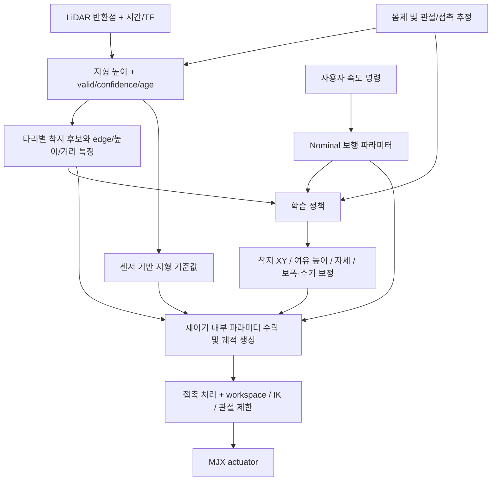

# MJX에서 학습하는 지형 적응 보행 파라미터

작성: 2026-09-06. 사용자 결정은 **MJX에서 보행을 먼저 만든 뒤 Isaac Lab으로 sim-to-sim 이식**이다.
이 문서는 다음 학습의 설계 기준이다. 현재 실행 중인 stage31 viewer가 아래 action을 이미 출력하거나,
새 정책/학습기가 구현·학습·검증됐다는 의미는 아니다.

## 목표와 현재 코드의 차이

기본 제어기가 보행을 유지하고, 학습 정책은 LiDAR 지형·착지 후보를 보고 잔발, 큰 보폭,
스윙 여유 높이, 몸체 피치/롤/높이를 조절한다. 후보 좌표를 별도 IK 모듈로 직접 실행하지 않는다.

현재 `mjx/firmware_mjx_controller.py`는 `GAIT_PHASE_TIME=0.5`와 적용 속도로 앞/뒤 발 목표를
계산한다. 기존 GT 환경에는 규칙 기반 `pitch_ff`, `swing_boost`, stair-assist가 있으며,
기존 18-D action은 보행 시간과 몸체 피치를 직접 선택하지 않는다. 따라서 기존 가중치의
지형 입력만 LiDAR로 바꿔서는 이 목표 전체를 학습한 정책이 되지 않는다.

## 제안 구조

구성은 `명목값 + LiDAR 기준값 + 학습 보정`이다. 예를 들어 관측된 단차와 거리가
피치·스윙 여유의 기준을 만들고, 정책은 발 위치·기울기·동작 이력을 보고 보정량을 정한다.
기준값 자체를 센서에서 만들므로 GT를 배포 제어에 사용하지 않는다.

제어기에서 foot trajectory와 foot memory를 한 번만 갱신한다. 외부 경로 덮어쓰기와
posture/contact 처리의 이중 적용을 금지한다. policy는 parameter request를 내며,
수락된 파라미터로 제어기만 발 목표와 관절 목표를 생성한다.

## 1차 action 제안: 23-D

다음은 구현 전 제안 계약이다. 범위는 로봇의 모든 상태에서 안전하다고 검증한 값이 아니며,
MJX 기구학/보행 확인 후 확정한다. 기존 v3/v4 18-D action에 이 action을 중복 합성하지 않는다.

| slice | 차원 | 의미 | 적용 시점 |
|---|---:|---|---|
| `0:12` | 12 | 6개 다리의 nominal 착지 XY 보정 | 다음 스윙 계획 경계에서 수락 |
| `12:18` | 6 | 6개 다리의 스윙 여유 높이 보정 | 스윙 시작에 고정 |
| `18:21` | 3 | 몸체 pitch, roll, height 보정 | 제어기 내부 rate limit/전체 다리 IK gate |
| `21` | 1 | nominal 대비 보폭 배율 | 다음 tripod 위상 경계 |
| `22` | 1 | nominal 대비 위상 시간 배율 | 다음 tripod 위상 경계 |

각 정규화 action은 [-1,1]이며, 0은 보정 없음/배율 1이다. 초기 제안 범위는 다음과 같다.

- 착지 XY bias: 각 축 ±4 cm. 지지 patch/작업공간에서 요청을 수락하거나 줄인다.
- 여유 높이 residual: 기준 대비 ±4 cm. 여유 높이는 takeoff/landing 중 높은 지면 위의 높이이며,
  기존 v3의 4~25 cm action 의미와 구분한다. 최종 apex/전체 경로의 IK·충돌 가능성을 검사한다.
- pitch residual ±10°, roll residual ±5°, body-height residual ±3 cm. 합성 자세의 총범위는 별도 제한한다.
- stride 배율 0.5~1.3, phase-time 배율 0.6~1.4. 이 범위들의 조합도 단독으로 안전을 보장하지 않는다.

착지 Z는 선택/수락한 관측 patch 높이와 발 접촉 형상으로 계산한다. 상공의 여유 높이와
착지면 높이를 한 Z action에 섞지 않는다. 필요한 접촉 탐색/소규모 순응은 기본 제어기의 역할이다.

### 보폭·주기·속도의 일관성

보폭을 줄이는 것만으로는 같은 속도의 잔발이 되지 않는다. 보폭과 주기를 함께 줄여야 한다.
반대로 보폭과 주기를 함께 늘리면 비슷한 평균 속도에서 큰 걸음을 만들 수 있다.

초기 구현은 하나의 공통 phase-time 배율을 쓰고 tripod 순서는 고정한다. 다리별 독립 frequency나
phase reset은 열지 않는다. 명령 속도, stride, phase duration으로 예측되는 몸체 이동과 stance 궤적을
같은 수식에서 계산해야 한다. 단순히 발의 왕복 거리만 배율로 곱하면 stance slip이 생길 수 있다.

대략적인 `평균 전진속도 ∝ 보폭 / 주기`는 설계 관계이며, 실제 속도는 접촉·미끄러짐·동역학에 따라 달라진다.
수락된 보행 속도·보폭·주기를 observation/로그에 함께 기록해 policy가 actuator clipping을 숨겨 이용하지 못하게 한다.

## 착지 후보와 관측 공백

policy는 로봇 전체 자세/속도 외에 다리별 다음 정보를 받는다.

- nominal 대비 후보의 앞뒤·좌우 거리와 높이 차이
- 지지 patch 크기, edge margin, 국소 경사/거칠기, 후보 유효 여부
- 스윙 경로의 장애물 높이와 관측 여부, 제어기의 도달 가능성
- map age/confidence와 실제 접촉, 위상, 이전에 수락된 파라미터

후보를 단일 정답 점으로 강제하기보다, 가능한 지지 영역과 제한된 주변 후보를 제공한다.
policy의 XY 요청을 그 영역에서 수락하고, 선택한 patch의 Z와 clearance로 제어기가 궤적을 만든다.
projection 거리와 거부 빈도를 기록/벌점 처리해 policy가 무효한 큰 요청을 내는 편법을 줄인다.

첫걸음의 해당 착지 영역이 미관측이면 기본 제어기의 nominal 보행으로 시작한다.
멀리 점이 하나 보였거나 전역 지도 커버리지가 커졌다는 이유로 모든 다리를 전환하지 않는다.
현재 스윙의 목표/주기를 센서 프레임 갱신으로 갑자기 바꾸지 않는다. 잔차 활성화·비활성화도 경계와
완화 규칙을 가지며, 실제 접촉은 예측보다 우선한다. 관측된 위험과 단순 미관측은 구분한다.

## GT의 역할과 학습 순서

MJX 안에서 먼저 다음 두 문제를 분리한다: 보행 파라미터로 동작이 가능한가, LiDAR로 그 동작을
판단할 수 있는가. 새 23-D 계약은 두 단계에서 동일하게 유지한다.

1. **기본 제어기와 파라미터 인터페이스:** action 0의 평지 보행, 위상 경계 적용, pitch/height와 6개 다리 IK,
   착지 후 stance 연속성을 사용자에게 확인받는다. 이후 학습이 그 위에서 동작한다.
2. **같은 action 공간의 GT teacher/feasibility:** MJX의 이상적인 지형 정보로 낮은 계단에서 시작해
   보폭·주기·높이·자세 조합이 유효한지 학습한다. 이 actor는 GT를 사용하는 학습용 기준이며 배포하지 않는다.
3. **LiDAR student:** 같은 제어기/지형에서 LiDAR raycast→map→후보를 입력한다. GT는 teacher/critic 및
   높이 복원 loss의 정답으로만 사용한다. teacher imitation 뒤 asymmetric PPO로 보행 성능을 학습한다.
4. **센서 공백과 오차:** 첫걸음 blind 구간, occlusion, dropout, delay, map/odom/TF 오차를 포함한다.
   teacher의 보행 보조도 학생이 관측할 수 없는 첫걸음에서는 nominal fallback 규칙을 지켜야 한다.
   학생에게 보이지 않는 정보를 알아야만 낼 수 있는 teacher action을 무조건 모사시키지 않는다.
5. **Held-out MJX 지형:** 계단 높이/폭·접근 방향·속도·센서 오차를 분리하고, 사용자 검증 후 정책을 고정한다.
6. **Isaac Lab sim-to-sim:** 먼저 같은 observation/정규화/action 의미/제어기 파라미터/주기/TF/접촉 기준으로
   재생한다. 정책을 바꾸기 전에 좌표·단위·관절 부호·actuator/contact 차이를 확인한다. 필요할 때 Isaac에서 추가 학습한다.

stage31은 이전 보행 비교 기준으로 보존한다. 현재 18-D 가중치에는 새 보폭·주기·자세 출력이 없으므로
새 23-D teacher로 직접 restore하지 않는다. 공통 부분 이관은 명시적 converter와 별도 검증이 있어야 한다.

### 보상 설계

발을 크게 들거나 몸을 많이 기울이는 것 자체를 보상하지 않는다. 목표 지형을 안정적으로 통과할 때
필요한 만큼 사용하는 정책이 목표다.

- 명령에 맞는 전진 progress와 실제 계단 통과를 보상한다.
- 넘어짐, 몸체 충돌, foot slip, 스윙 중 조기 장애물 충돌과 과도한 충격을 벌점 처리한다.
- 접촉 순간의 지지 영역/edge margin과 착지 오차를 평가한다. 이동 중인 발을 매 순간 착지점에 붙이는 loss는 쓰지 않는다.
- 관절 한계 접근, IK 거부/projection, 큰 residual, 빠른 파라미터 변화, 불필요한 발 높이/기울기를 벌점 처리한다.
- 단차를 넘기 위한 짧은 감속/잔발을 허용하되, 정지나 제자리 발짓으로 보상을 얻지 못하도록 시간 구간 progress와 통과 목표를 둔다.
- pitch/roll 안정성은 절대 수평만 강제하지 않고 수락된 몸체 자세 목표와 각속도를 함께 평가한다.

높이 GT와의 Huber/L1 loss는 인식 표현을 학습하는 보조 loss다. 그 loss만으로 보행 파라미터의
선택을 학습할 수는 없다. reward/critic과 sensor reconstruction을 역할별로 분리한다.

## MJX 구현 순서와 이식 산출물

센서와 제어 인터페이스는 처음부터 고정 크기의 batch 배열로 설계한다. 현재 viewer의 CPU raycast와
NumPy 후보 계획을 GPU PPO 수천 환경 안에 그대로 호출하지 않는다. MJX에서 센서 ray의 실제 가림/FOV를
처리하는 batch 경로를 별도로 만들며, GT 높이에 noise만 더한 것을 LiDAR라고 부르지 않는다.

구현 순서는 controller parameter interface → 23-D 학습 환경 → 센서 map/candidates → teacher/student
학습 entry point → 현재 viewer의 새 checkpoint 모드다. 현재 stage31 viewer는 비교용으로 보존한다.
학습/실행 검증은 사용자에게 맡기며, 이 설계 문서 작성으로 학습을 자동 시작하지 않는다.

Isaac 이전에 저장할 contract는 action/observation schema, parameter bounds/neutral, 좌표/단위,
센서 TF/FOV/주기, terrain raster 규칙, normalizer, joint order/sign, 제어기 버전, command/action/state
재생 trace와 termination 정의다. JAX/PhysX의 물리 결과가 수치적으로 같아야 한다고 가정하지 않는다.

## 참고 근거

- [Policies Modulating Trajectory Generators](https://arxiv.org/abs/1910.02812): 구조화된 trajectory generator를 정책으로 조절하는 접근의 근거.
- [Learning robust perceptive locomotion](https://leggedrobotics.github.io/rl-perceptiveloco/): privileged teacher와 noisy terrain input student, 환경 복원 학습의 근거.

위 연구는 설계 방향의 참고이며 이 hexapod에 대한 검증 결과가 아니다.
