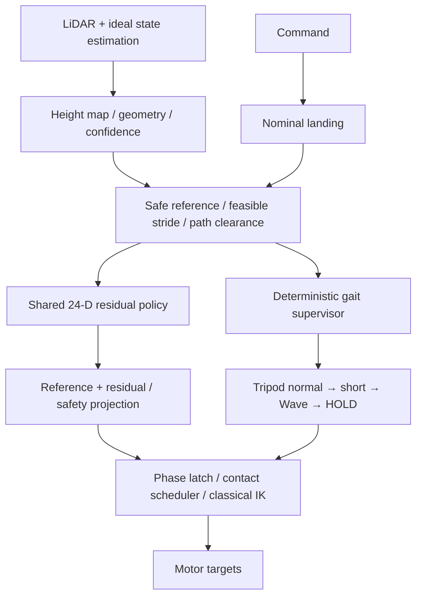

> 이 문서는 이전 개발 단계의 설계/사용 이력을 포함합니다. 현재 v4 contract, timing, 실행 경로는 [통합 문서](ADAPTIVE_INTEGRATION_V4.md)를 따릅니다.

# MJX 지형 적응 residual 학습 설계

업데이트: 2026-09-06. 이전 23-D 초안은 **24-D hybrid 계약**으로 대체한다.
실행·구현 범위·제약은 [사용 가이드](HEXAPOD_MJX_ADAPTIVE_GAIT_USAGE.md),
변경 전 코드 분석과 main 대조는 [분석 문서](HEXAPOD_HYBRID_GAIT_ANALYSIS.md)를 기준으로 한다.

## 역할 분리

LiDAR가 계산할 수 있는 height, normal, slope, roughness, edge, observed support extent,
coverage/confidence, path obstacle, IK margin을 정책이 다시 추론하도록 맡기지 않는다.
planner가 reference와 feasible scale bank를 만들고 Z를 소유한다.
RL은 XY12 + apex6 + roll/pitch/height3 + stride1 + apex-phase1 + transfer1만 조절한다.
phase duration과 gait selector는 action에서 제외한다. residual=0에서도 baseline이 동작하도록 구성한다.

후보 6×25, top-K=3, Tripod 조합 27은 고정 shape JAX다.
25 후보 전체가 workspace 안이라는 가정은 하지 않는다. footprint/edge/IK/path/support gate로 거른다.
UNKNOWN은 unsafe와 구분하며 기본 hybrid에서는 다음 phase를 HOLD한다.
Wave는 관측된 Tripod normal/short 실패 뒤에만 선택하고 전환은 all-contact 경계에서만 실행한다.
단일 policy가 모든 다리 action을 출력하고 scheduler가 active swing에만 latch한다.

## 학습 순서

| 단계 | 목적 | 다음 단계 전 사용자 확인 |
|---|---|---|
| 0 | policy 없이 oracle vs LiDAR planner | map MAE, safe recall, false-safe, unknown, edge, 착지 오차 |
| 1 | Tripod only, flat → ramp → 작은 계단 | action 0 baseline과 residual 개선, 잔발/높이/자세 |
| 2 | Wave only, 같은 지형 순차 | main의 RF LB RM LF RB LM, Early/Late, support recovery |
| 3 | 같은 policy + deterministic supervisor | normal→short→Wave→HOLD, 복귀 hysteresis |
| 4 선택 | learned gait selector / teacher-student | deterministic 방식의 한계가 확인된 경우에만 |

Stage 0 실패를 PPO가 고쳐줄 것으로 기대하지 않는다. 새 학습은 아직 시작하지 않았고,
학습 전 641-D/23-D와 호환되지 않는 actor 4410-D/action24 계약을 명시적으로 버전 관리한다.
기존 stage31 18-D 파일과 viewer 경로는 유지한다.

## Reward와 이전 계획

속도 추종은 supervisor가 수락한 속도를 기준으로 한다. 진행/안정적인 touchdown을 보상하고
collision, slip, IK projection, planner rejection, landing error와 큰 residual/action 변화에 비용을 둔다.
Wave 사용·전환 비용은 작게 두며 gait 자체를 RL이 위험하게 선택할 수는 없다.
apex/자세 baseline과 최종 gate를 제거하는 방식으로 reward를 최적화하지 않는다.

MJX에서 Stage 0–3을 확인한 뒤 Isaac Lab에 동일 action 순서·프레임·발 중심 반경·센서 TF,
gait sequence·timing/contact contract를 옮긴다. 먼저 action=0과 기록 action replay를 비교하고,
이후 센서/마찰/접촉 차이를 맞춘다. 현 단계에서 Isaac Lab 실행 코드는 변경하지 않았다.
D435 RGB semantic/traversability의 LiDAR map projection은 이후 확장이다.

현재 구현은 sampled foot path와 quasi-static support 검사다. 전신 collision, 동적 안정성,
mid-swing 새 장애물 abort, 실제 LIO, 장면별 자동 curriculum, imitation gait selector는 후속 작업이다.
세부 limitation을 숨긴 채 최종 성공 조건을 달성했다고 간주하지 않는다.
